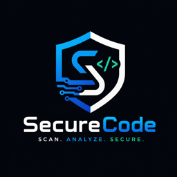

<p align="center">
  
</p>

<h1 align="center">SecureCode</h1>

<p align="center">
  <strong>Catch setup problems before they catch you.</strong>
</p>

<p align="center">
  <a href="https://open-vsx.org/extension/manish-srivastav/securecode"></a>
  <a href="https://github.com/Roxtop07/project-setup-doctor/blob/main/LICENSE"></a>
  <a href="https://github.com/Roxtop07/project-setup-doctor"></a>
</p>

<p align="center">
  <em>One-click project health analysis for VS Code, Cursor, Windsurf, VSCodium & Antigravity</em>
</p>

---

**SecureCode** scans your repository and detects setup, environment, dependency, security, and configuration problems — **before you even run the project**.

No API keys. No cloud. No telemetry. Just fast, offline analysis.

---

## Why SecureCode?

Every developer has wasted hours on:

- "Why won't this project start?" — missing `.env` variables
- "Works on my machine" — wrong Node/Python version
- "Who committed that API key?" — hardcoded secrets
- "Where are the setup instructions?" — empty README

**SecureCode finds all of these in under 5 seconds.**

---

## Features at a Glance

| Feature | What it does |
|---------|-------------|
| **Project Detection** | Auto-detects 25+ project types: Node.js, Python, Go, Rust, Java, Kotlin, Ruby, PHP, C#, Swift, Dart, Elixir, C/C++, and more |
| **Environment Validator** | Missing `.env` vars, malformed values, missing runtimes (Node, Python, Docker) |
| **Dependency Scanner** | Duplicates, unpinned versions, missing lockfiles, missing `node_modules` (npm + pip) |
| **Security Scanner** | Hardcoded API keys, tokens, passwords in source code; missing `.gitignore` entries |
| **README Checker** | Verifies install instructions, setup sections, environment variable docs |
| **Docker Analyzer** | `:latest` tag warnings, missing `USER` directive, missing `.dockerignore` |
| **Health Score** | Weighted 0-100 score with A-F grading across 5 categories |
| **Auto Fixes** | One-click: create `.env.example`, generate Dockerfile, install missing deps |
| **JSON Export** | Export full scan results for CI/CD integration |

---

## How It Works

```
Open project  ──>  Auto-scan  ──>  Health Score  ──>  Fix Issues
                                       │
                    ┌──────────────────┼──────────────────┐
                    │                  │                  │
               Sidebar            Status Bar        Problems Panel
            (score ring +       (82/100 B)        (file-level
             issue list)                           diagnostics)
```

1. **Open any project** — SecureCode activates automatically
2. **Instant scan** — analyzes your project structure, dependencies, config, and code
3. **See results everywhere** — sidebar dashboard, status bar score, Problems panel
4. **Fix with one click** — auto-fix buttons for common issues
5. **Stay updated** — file watchers re-scan on changes automatically

---

## Example Output

```
Health Score: 62/100 (C)

  ✖ MISSING_VAR is in .env.example but missing from .env
  ✖ Possible OpenAI API key found in src/config.js:12
  ⚠ No lockfile (package-lock.json) found
  ⚠ .env file exists but is not in .gitignore
  ⚠ Dockerfile uses :latest tag
  ⚠ README has no install/setup instructions
  ℹ No .dockerignore found
  ℹ No virtual environment (.venv) found
```

---

## Supported Project Types

| Type | Detected by |
|------|-------------|
| **Next.js** | `next` in package.json |
| **React** | `react` in package.json |
| **Node.js / Express** | `express` or generic package.json |
| **FastAPI** | `fastapi` in requirements.txt / pyproject.toml |
| **Flask** | `flask` in requirements.txt / pyproject.toml |
| **Django** | `django` in requirements.txt / pyproject.toml |
| **Python** | requirements.txt / pyproject.toml present |
| **EPL** | `.epl` files or `eplang` in dependencies |
| **Go** | go.mod present |
| **Rust** | Cargo.toml present |
| **Java** | pom.xml or build.gradle present |
| **Kotlin** | `kotlin` in build.gradle.kts / build.gradle |
| **Scala** | `scala` in build configuration |
| **Ruby** | Gemfile present |
| **PHP** | composer.json present |
| **C# / .NET** | *.csproj or *.sln present |
| **Swift** | Package.swift present |
| **Dart / Flutter** | pubspec.yaml present |
| **Elixir** | mix.exs present |
| **C / C++** | CMakeLists.txt, Makefile, or source files present |
| **Haskell** | *.cabal or stack.yaml present |
| **Clojure** | project.clj or deps.edn present |
| **Perl** | cpanfile or Makefile.PL present |
| **Lua** | *.rockspec present |
| **Docker** | Dockerfile present |

---

## Commands

Open the Command Palette (`Ctrl+Shift+P` / `Cmd+Shift+P`) and type `SecureCode`:

| Command | Description |
|---------|-------------|
| `SecureCode: Scan Project` | Run full project analysis |
| `SecureCode: Show Health Report` | Open detailed health report panel |
| `SecureCode: Run Auto Fixes` | Pick and apply available fixes |
| `SecureCode: Generate Env Template` | Create `.env.example` from your code |
| `SecureCode: Export JSON Report` | Save scan results as JSON file |

---

## Settings

| Setting | Default | Description |
|---------|---------|-------------|
| `secureCode.autoScanOnOpen` | `true` | Scan automatically when you open a project |
| `secureCode.backendPort` | `18120` | Port for the local analysis server |
| `secureCode.scanDebounceMs` | `2000` | Delay before re-scanning after file changes |
| `secureCode.enableTelemetry` | `false` | Anonymous telemetry (off by default) |
| `secureCode.excludePaths` | `[...]` | Directories to skip during scanning |

---

## Health Score Breakdown

Your score is calculated across 5 weighted categories:

| Category | Weight | What it checks |
|----------|--------|---------------|
| **Dependency Hygiene** | 25% | Lockfiles, pinned versions, no duplicates, deps installed |
| **Setup Readiness** | 25% | .gitignore, .env.example, Dockerfile, docker-compose |
| **Security** | 20% | No hardcoded secrets, .env in .gitignore, safe npm scripts |
| **Documentation** | 15% | README exists with install, run, and env var sections |
| **Environment** | 15% | .env matches .env.example, runtimes available on PATH |

**Grades**: A (90+) · B (75+) · C (60+) · D (40+) · F (<40)

---

## Security Checks

SecureCode scans for hardcoded secrets including:

- OpenAI API keys (`sk-...`)
- GitHub personal access tokens (`ghp_...`)
- AWS access key IDs (`AKIA...`)
- Generic API keys, passwords, tokens, and secrets in source code
- `.env` files not listed in `.gitignore`
- Dangerous commands in npm scripts (`curl | sh`, `rm -rf /`)

All scanning is **local and offline** — your code never leaves your machine.

---

## Auto Fixes

Click the **Fix** button next to any issue, or use `SecureCode: Run Auto Fixes` to batch-apply:

| Fix | What it does |
|-----|-------------|
| Create `.env.example` | Generates template from your `.env` or source code references |
| Create `.gitignore` | Adds standard entries for your project type |
| Create `.dockerignore` | Adds standard Docker ignore patterns |
| Generate Dockerfile | Creates a basic Dockerfile for Node.js or Python projects |
| Install dependencies | Runs `npm install` or `pip install -r requirements.txt` |
| Create virtual environment | Runs `python3 -m venv .venv` |

All commands run locally. Only allowlisted commands are executed — no arbitrary shell access.

---

## Requirements

- **Python 3.10+** — powers the analysis backend
- **Node.js 18+** — for the extension runtime

Both must be available on your `PATH`. The extension will notify you if they're missing.

---

## Privacy & Telemetry

- **Offline-first** — all analysis runs locally on `127.0.0.1`
- **No telemetry** by default — opt-in only
- **No cloud** — your code never leaves your machine
- **No API keys required** — core features work without any configuration
- **No data collection** — we don't track usage, projects, or scan results

---

## Cross-IDE Support

SecureCode works in any editor that supports VS Code extensions:

- **VS Code**
- **Cursor**
- **Windsurf**
- **VSCodium**
- **Antigravity**
- Any OpenVSX-compatible editor

---

## Contributing

Contributions welcome! See the [GitHub repository](https://github.com/Roxtop07/project-setup-doctor) for:

- Architecture documentation
- How to add custom analyzers
- Development setup guide
- Build and packaging instructions

---

## License

[MIT](https://github.com/Roxtop07/project-setup-doctor/blob/main/LICENSE)

---

<p align="center">
  Made by <a href="https://github.com/Roxtop07">Manish Srivastav</a>
</p>
